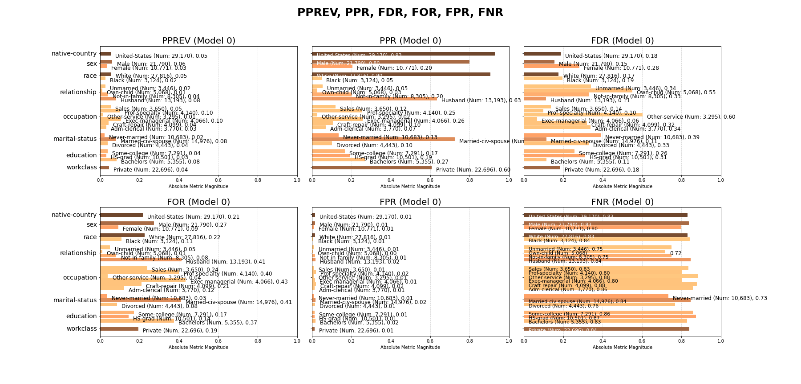

# Model Card

For additional information see the Model Card paper: https://arxiv.org/pdf/1810.03993.pdf

## Model Details
– Developed by Jake Fund
– September 2, 2021
– v1
– Logistic Regression
– Model needs one-hot encoder and labelizer transformers
– Citation details:
* https://arxiv.org/pdf/1810.03993.pdf
* @article{2018aequitas,
     title={Aequitas: A Bias and Fairness Audit Toolkit},
     author={Saleiro, Pedro and Kuester, Benedict and Stevens, Abby and Anisfeld, Ari and Hinkson, Loren and London, Jesse and Ghani, Rayid}, journal={arXiv preprint arXiv:1811.05577}, year={2018}}

## Intended Use
– Primary intended uses:The model is created to predict salary based on demographic data

## Training Data
– Datasets: 80% of https://archive.ics.uci.edu/ml/datasets/census+income 
– Preprocessing: categorical data is put into one hot encoding. 
– Algorithm: A grid search of the sci-kit learn random forest algorithm was used with the following parameters:

## Evaluation Data
– Datasets:20% of https://archive.ics.uci.edu/ml/datasets/census+income 
– Preprocessing:categorical data is put into one hot encoding
 'max_depth': 25,
 'min_samples_leaf': 1,
 'min_samples_split': 5,
 'n_estimators': 500
## Metrics
The metrics for the test set are as following:
Test results: Precision: 0.8849765258215962 Recall: 0.706875 Fbeta: 0.7859624739402363

## Ethical Considerations
– Intersectional results:

## Caveats and Recommendations
